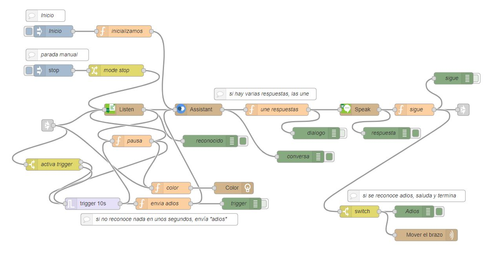

# vtjbot-nodered-flows
## Flujos de Node-RED creados para mostrar los servicios de Watson a estudiantes mediante TJBot virtual

Estos flujos son ejemplos que utilizan los nodos de TJBot virtual en Node-RED. 

La mayoría de ellos se presentan en la sesión [Watson Va a Clase – TjBot Virtual en Node-Red](https://www.ptech.org/events/tjbot-virtual-node-red/)

Son un buen complemento a la imagen Docker presentada en la misma sesión: [jimbotel/vtjbot-nodered-docker](https://hub.docker.com/repository/docker/jimbotel/vtjbot-nodered-docker)

## 1) Análisis de Tono

Este flujo ([01.vtjbot.analisis.tono.json](flows/01.vtjbot.analisis.tono.json)) muestra un ejemplo de uso del nodo "analyze tone" (análisis de tono), que se apoya en el servicio "Tone Analyzer" de IBM Cloud para realizar un análisis del tono de un texto de entrada.

El análisis se realiza a dos niveles, de frase y de documento, y es capaz de detectar tres tipos de tonos, incluidos la emoción (ira, asco, miedo, alegría y tristeza), las actitudes sociales (franqueza, diligencia, extroversión, simpatía y rango emocional), y los estilos de lenguaje (analítico, seguro y vacilante).

El texto de entrada de ejemplo se trata de una serie de mensajes de Twitter.

## 2) Encendido del LED virtual con un color elegido mediante la voz  

El propósito de este flujo ([02.vtjbot.led.voz.json](flows/02.vtjbot.led.voz.json)) es demostrar cómo combinar varios bloques para crear soluciones novedosas.

En este caso combinamos los nodos "Listen" ("Speech To Text", reconocimiento de voz), "Speak" ("Text to Speech", conversión de texto a voz) y "Translate" ("Language Translator", traducción de idioma).

El flujo recibe un color expresado mediante la voz, el cual pasa a texto. A continuación, repite mediante voz lo que ha entendido a la vez que traduce el texto a inglés antes de pasárselo como entrada al nodo "shine", el cual ilumina el LED con el color elegido.

El flujo tiene algunos "trucos" para parar el servicio de reconocimiento tan pronto haya reconocido algo, e introduce un retraso de 4 segundos de forma que la luz del LED vuelve a apagarse al final pasado ese tiempo.

## 3) Conversación (Asistente por voz)

Este flujo ([03.vtjbot.conversa.json](flows/03.vtjbot.conversa.json)) sirve como interfaz de voz para un Skill creado mediante Watson Assistant. 

Utiliza los nodos "Listen" ("Speech To Text", reconocimiento de voz), "assistant" ("Watson Assistant", para crear interfaces de conversación) y "Speak" ("Text to Speech", conversión de texto a voz).

Estos nodos se encadenan en un bucle para permitir que la conversación progrese, hasta que nos callamos o se llega al nodo de "adios". 

Aunque se puede integrar con otros "Skills" desarrollados a medida, se proporciona un Skill de Watson Assistant ya hecho, para facilitar la demostración: ([skill-workspace-tjbot.json](flows/skill-workspace-tjbot.json))

Este Skill se puede importar directamente en Watson Assistant, tras lo cual se ha de apuntar el denominado "WorkSpace ID" en los detalled de la API. 

Aparece como:

Tenemos que fijarnos en la línea:

   Legacy v1 workspace URL:  https://gateway-lon.watsonplatform.net/assistant/api/v1/workspaces/el-workspace-id/message

Nos interesa el código que aquí hemos puesto como "el-workspace-id". Este código es el que hay que poner en el campo "WorkSpace ID" en la configuración de TJBot virtual. 

## 4) Conversación Telegram 

Este flujo ([04.vtjbot.conversacion.telegram.json](flows/04.vtjbot.conversacion.telegram.json)) conecta un Skill de Watson Assistant con un chatbot de Telegram, permitiendo conversar desde Telegram.

Para probarlo se puede utilizar el mismo Skill del ejercicio anterior  ([skill-workspace-tjbot.json](flows/skill-workspace-tjbot.json)). 

Las instrucciones detalladas para la creación del chatbot pueden encontrarse en la formación de Watson va a Clase.

## 5) Tomar una foto y mostrarla

Este flujo ([05.vtjbot.foto.url.json](flows/05.vtjbot.foto.url.json)) hace una foto y la muestra en el navegador. 

Para ello utilizamos el nodo "See" de TJBot virtual en modo "Take photo".

Para hacer la foto abrir una nueva pestaña y poner la dirección: https://direccionIP:puerto/foto 

utilizando los mismos "direccionIP:puerto" que los empleados para acceder a Node-RED.

## 6) Reconocimiento de imagen

Este flujo ([06.vtjbot.reco.imagen.json](flows/06.vtjbot.reco.imagen.json)) toma una foto y la analiza mediante el servicio Watson Visual Recognition. 

Para ello utilizamos el nodo "See" de TJBot virtual en modo "See (identify objects)". 

Nota: el servicio Watson Visual Recognition ya no está disponible en nuevas cuentas y va a descontinuarse a finales de 2021 debido a una [decisión de IBM tomada en Junio de 2020](https://elpais.com/tecnologia/2020-06-09/ibm-abandona-la-tecnologia-de-reconocimiento-facial-por-las-dudas-eticas-sobre-su-utilizacion.html).

